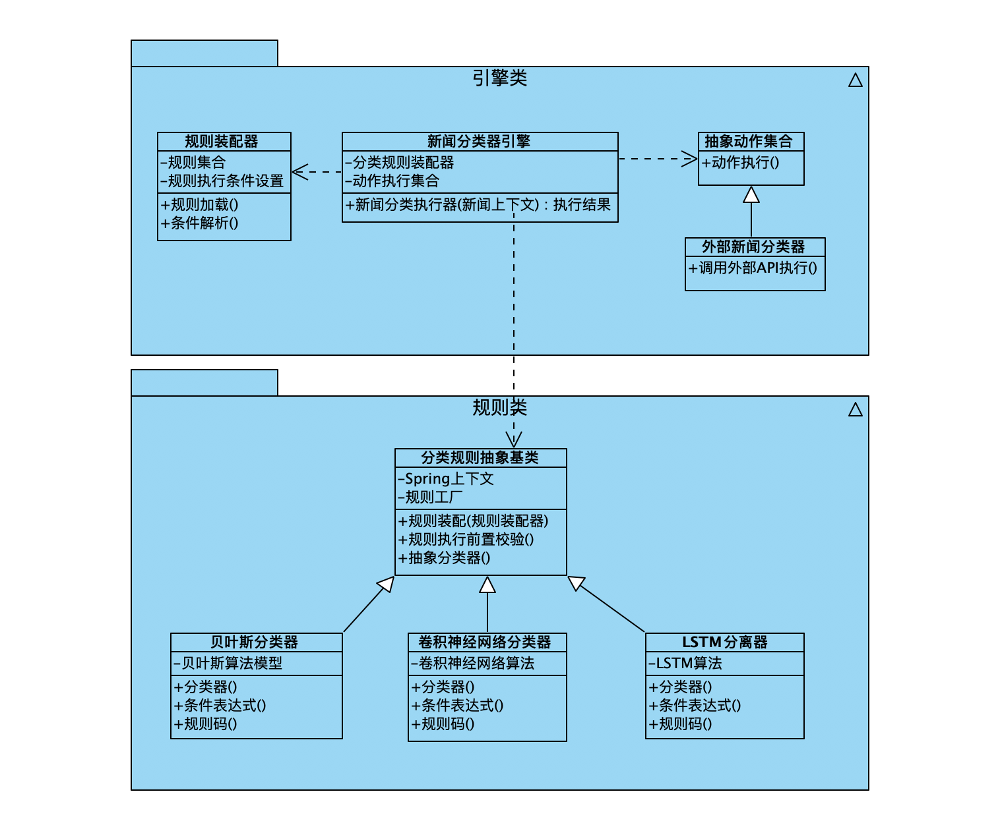

### 新闻分类器

本demo设计了一个新闻分类器，通过引擎路由到具体的规则，然后调用算法去执行新闻分类，整体框架如下：



### Mockito测试

通过Mockito测试，对上述功能进行集成测试，拆解不同的动作集合，按照规则维度去执行，测试方法和测试用例如下：

1. 引入pom依赖

```xml
<dependency> 
    <groupId>org.mockito</groupId> 
    <artifactId>mockito-all</artifactId> 
    <version>1.8.5</version> 
    <scope>test</scope> 
</dependency>
```

2. 编写相关的测试用例

2.1 使用when then设置参数和预期返回值进行Mock测试

```java
    /**
     * 定义需要“假执行”的方法，并预先设定好该方法需要返回的值。当底层执行到该方法时，
     * 不会真正执行方法并返回自己预先设定好的值。
     * 注意点：实际调用方法传入的参数必须跟预先设定“假执行”的方法参数一致，否则不生效。
     * 如下：预先定义“假执行”bayesAlgorithmDAL.findResultByKey(String id)的方法参数是"10001"，
     * 那么bayesAlgorithmDAL.findResultByKey("10001")传入与当前参数一致回返回true,否则返回false
     * bayesAlgorithmDAL.findResultByKey(Matchers.anyString())表示任意字符都返回true
     */
    @Test
    public void bayesCheckRuleTest(){
        Mockito.when(bayesAlgorithmDAL.findResultByKey("10001")).thenReturn(true);
        Assert.assertTrue(bayesAlgorithmDAL.findResultByKey("10001"));
        Assert.assertFalse(bayesAlgorithmDAL.findResultByKey("10002"));
        Mockito.when(bayesAlgorithmDAL.findResultByKey(Matchers.anyString())).thenReturn(true);
        Assert.assertTrue(bayesAlgorithmDAL.findResultByKey("****"));
    }
```

2.1 使用when then设置任意参数和预期返回值进行Mock测试

```java
    /**
     *  如果rule层跟dal层方法参数实在做不到一致。
     *  如下：rule层newsBayesCheckRule.check(serviceCtx);
     *       dao层bayesAlgorithm.useModel(AlgorithmDO);
     *   这种情况我们使用Mockito.isA(AlgorithmDO.class); 定义只有方法参数是类对象AlgorithmDO就行
     */
    @Test
    public void bayesUserModelTest(){
        Mockito.when(bayesAlgorithm.useModel(Mockito.isA(AlgorithmDO.class))).thenReturn(false);
        NewsBaseServiceCtx serviceCtx = new NewsBaseServiceCtx();
        Assert.assertEquals("属于负面新闻", newsBayesCheckRule.check(serviceCtx));
        Mockito.when(bayesAlgorithm.useModel(Mockito.isA(AlgorithmDO.class))).thenReturn(true);
        Assert.assertNotEquals("属于负面新闻", newsBayesCheckRule.check(serviceCtx));
    }
```

2.3 使用when then Answer可以采用反射返回不同的值进行测试

```java
    /**
     *  使用when then Answer可以采用反射返回不同的值进行测试
     */
    @Test
    public void otherTest(){
        Mockito.when(newsCheckEngine.execute(Mockito.isA(NewsBaseServiceCtx.class))).thenAnswer(new Answer<BaseServiceResult>() {
            @Override
            public BaseServiceResult answer(InvocationOnMock invocation) throws Throwable {
                Object[] args = invocation.getArguments();
                // 获取参数
                NewsBaseServiceCtx serviceCtx = (NewsBaseServiceCtx) args[0];
                BaseServiceResult result = new BaseServiceResult(true);

                // 根据第1个参数，返回不同的值
                if (serviceCtx == null) {
                    throw new RuntimeException("异常");
                }else if (serviceCtx.getTopic()==null) {
                    result.setSuccess(false);
                    return result;
                }else if (serviceCtx.getTopic().equals("hello")) {
                    result.setSuccess(false);
                    result.setResultCode("world");
                    return result;
                }
                return result;
            }
        });
        NewsBaseServiceCtx serviceCtx = new NewsBaseServiceCtx();
        serviceCtx.setTopic("hello");
        Assert.assertEquals(newsCheckEngine.execute(serviceCtx).getResultCode(), "world");

        serviceCtx.setTopic(null);
        Assert.assertFalse(newsCheckEngine.execute(serviceCtx).isSuccess());

        try {
            newsCheckEngine.execute(null);
        } catch (RuntimeException ex) {
            Assert.assertEquals("异常", ex.getMessage());
        }
    }
```